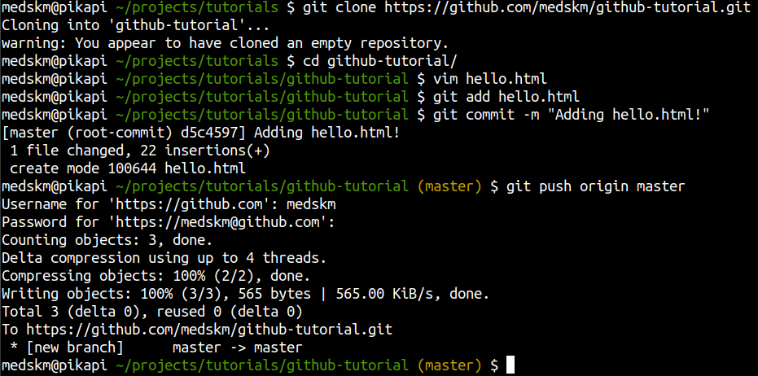
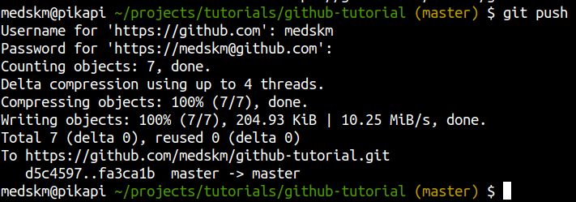

# Git Exploration Session

## What is Git?

Git is a tool for managing your code projects. 

### Github is to Code Files as Google Drive is to Documents...
If you've used cloud storage software like Google Drive, Box, DropBox, etc. 
to save and share documents, you will probably quickly recognize similarities
with Github or Gitlab (which are sites that host your code repositories).

Similar to Google Drive (and related tools), the most common use cases of Github are:
* Save versions of your programming work online so you can work on it across multiple
  computers
* Share and collaborate on code projects (you are not allowed to put your homework assignments in
  a public Github repository though, unless otherwise specified)
  * Code collaboration is common at internships, peer programming projects, hackathons,
    and online code portfolios to link in your resume
* Manage "versions" of your code and easily revert back to a previous version whenever
  needed

## How to use Git
This tutorial will use Git with Github. You can follow the directions on [github.com](https://github.com) to
create an account and create a new repository. Your main page on github.com will show a button
to create a New Repository:


Once you create a repository on github.com, 
you will get a page with tips on how to "clone" it on your computer for offline work:


Here is an example of cloning this public repository, adding my first file (`hello.html`)
commiting my work with a summary message, and pushing my commit to github.com so others can
access it on github.com (or alternatively, so I can clone the repo on another computer
when needed).



While you don't need to know the other commands, `cd` is a command on the command line to
"change directory", since I need to go into the github-tutorial directory to access the
git repository code. `vim` is a tool on the command line that opens and text editor so 
I can quickly create a file (similar to Atom or Sublime).

Here's a second commit to push this `README.md` with the screenshots you've seen on this
tutorial!




When you're first using Git, it's easy to forget to:
* commit before adding anything to your commit
* push without a new commit

Remember, the basic workflow for simple code projects after you've cloned your repository
for the first time is to:
1. Make changes or add new files:
```
git add <files-changed>
```
2. Make a commit with a message when you're ready to save your work online:
```
git commit -m "message"
```
3. Finally, make the official push for your commit to publish the code on github.com
```
git push
```

One of the advantages of Github is to allow you or peers to work on the same code
repository on multiple computers. When you both have the repository cloned on the
computer, you can also both make changes and save your work for others to see and iterate
on. However, you need to make sure to always "pull" the current state of the "master"
branch github manages to avoid conflicts. To pull changes from github into your local
repository, use the following command:
```
git pull
```

As long as you don't have any changes you haven't pushed that conflict with the version on
github.com, you'll see the changes right away! If you get any "conflict" messages, you'll
need to resolve them. But that's a tutorial for another day! But here's an [excellent
overview](https://www.git-tower.com/learn/git/ebook/en/command-line/advanced-topics/merge-conflicts) 
I would recommend checking out if you run into the issue.
